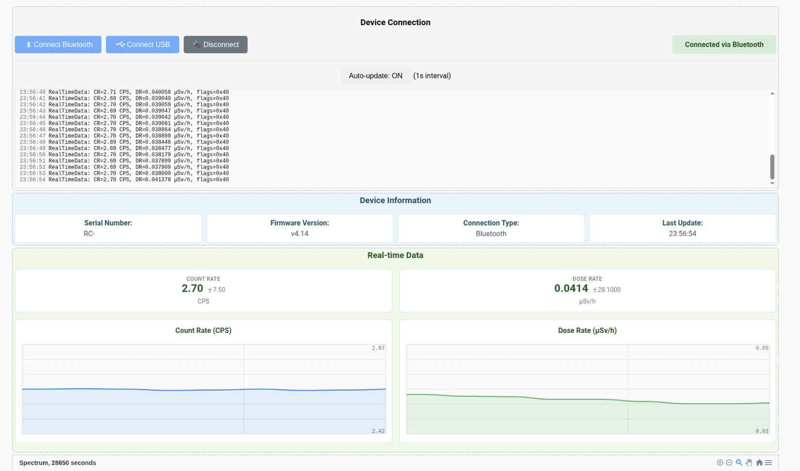

# radiacode.js

A web-based interface for RadiaCode radiation detection devices. Connects via USB or Bluetooth



> Rename notice: This repository was renamed from "radiacode-web" to "radiacode.js". The library now has shims (usb and webbluetooth) to work in node.js in addition to the browser.

## About

This project is based on [https://github.com/cdump/radiacode](https://github.com/cdump/radiacode) and provides a browser-based interface for connecting to and interacting with RadiaCode devices.

## Usage

1. Clone this repo: `git clone https://github.com/bsharper/radiacode.js`
2. Open `index.html` in a Chrome-based browser (Chrome, Edge, or other Chromium-based browsers)
3. Click "Connect Bluetooth" to connect to your RadiaCode device

## Standalone

There is very simple `create_standalone.py` script that will generate a fully self-contained HTML file called "standalone.html". It does this by inlining all external script references. The resulitng file (standalone.html) should work anywhere, even without internet. You can generate the file locally or just use the "standalone.html" in the repo. 

## Requirements

- Chrome-based browser with Web Bluetooth API support
- RadiaCode device with Bluetooth capability

## Node.js usage

- Install deps: `npm install`
- Run the fancy TUI: `npm run tui`
- Minimal example (USB preferred, falls back to Bluetooth):

```js
// file: node_example.js
const { RadiaCode } = require('./radiacode');

(async () => {
    try {
        let device = new RadiaCode();
        await device.connect();
        const version = await device.fw_version();
        const serial = await device.serial_number();
        console.log(version);
        console.log(serial);
        let poll = setInterval(async () => {
            const r = await device.real_time_data()
            console.log(r)
        }, 1000)
        
        const cleanup = async () => {
            clearInterval(poll);
            try { await device.disconnect(); } catch {}
            process.exit(0);
        };
        process.on('SIGINT', cleanup);
        process.on('SIGTERM', cleanup);
  } catch (e) {
    console.error('Connect failed:', e.message);
    process.exit(1);
  }
})();
```

Run: `node node_example.js`

Notes:
- On Node, the library auto-attaches WebUSB/WebBluetooth shims via `usb` and `webbluetooth` packages.
- On Linux, USB access may require udev permissions for VID 0x0483 / PID 0xF123.

## License

See the [LICENSE](LICENSE) file for details.
